# mycobot_ros2

[](https://docs.elephantrobotics.com/docs/gitbook/12-ApplicationBaseROS/12.2-ROS2/12.2.1-ROS2%E7%9A%84%E5%AE%89%E8%A3%85.html)
[](https://docs.elephantrobotics.com/docs/gitbook-en/12-ApplicationBaseROS/12.2-ROS2/12.2.3-ROS2%E4%BB%8B%E7%BB%8D.html)

[中文文档](https://docs.elephantrobotics.com/docs/gitbook/12-ApplicationBaseROS/12.2-ROS2/12.2.1-ROS2%E7%9A%84%E5%AE%89%E8%A3%85.html) | [English Documentation](https://docs.elephantrobotics.com/docs/gitbook-en/12-ApplicationBaseROS/12.2-ROS2/12.2.3-ROS2%E4%BB%8B%E7%BB%8D.html)

myCobot ROS2 package

**Notes**:

* Make sure that `Atom` is flashed into the top Atom and `Transponder` or `minirobot` is flashed into the base Basic .The tool download address: [https://github.com/elephantrobotics/myCobot/tree/main/Software](https://github.com/elephantrobotics/myCobot/tree/main/Software)
* Supported ROS2 versions:
  * Ubuntu 20.04 / ROS2 Foxy - branch `foxy`
  * Ubuntu 20.04 / ROS2 Galactic - branch `galactic`
  * Ubuntu 22.04 / ROS2 Humble - branch `humble`
  * Orin Nano Ubunut 20.04 / ROS2 Foxy - branch `foxy`
  * LimoPro Orin Nano Ubunut 20.04 / ROS2 Foxy - branch `foxy`
  * PC Virtual Machine Ubunut 20.04 / ROS2 Foxy - branch `foxy`

## Installation

### 1.1 Pre-Requriements

For using this package, the [Python api](https://github.com/elephantrobotics/pymycobot) library should be installed first.

```bash
pip install pymycobot --user
```

### 1.2 Package Download and Install

Install ros package in your src folder of your Colcon workspace.

```bash
$ cd ~/colcon_ws/src
# For the humble branch
$ git clone -b humble --depth 1 https://github.com/elephantrobotics/mycobot_ros2.git
# For the foxy branch
$ git clone -b foxy --depth 1 https://github.com/elephantrobotics/mycobot_ros2.git
# For the galactic branch
$ git clone -b galactic --depth 1 https://github.com/elephantrobotics/mycobot_ros2.git
$ cd ~/colcon_ws
$ vcs import src < src/warehouse_ros_mongo.repos
$ sudo apt-get update && rosdep install --from-paths src --ignore-src -y
$ colcon build
$ source ~/colcon_ws/install/setup.bash
$ sudo echo 'source ~/colcon_ws/install/setup.bash' >> ~/.bashrc
```

## Troubleshooting

1. On ROS2 Humble if slider_control does not show GUI properly, update file
   `/opt/ros/humble/lib/python3.10/site-packages/joint_state_publisher_gui/joint_state_publisher_gui.py`
   from here: https://github.com/ros/joint_state_publisher/blob/ros2/joint_state_publisher_gui/joint_state_publisher_gui/joint_state_publisher_gui.py


## URDF Model Graph

[mycobot 280 m5](./mycobot_description/urdf/mycobot_280_m5/mycobot_280_m5.urdf)

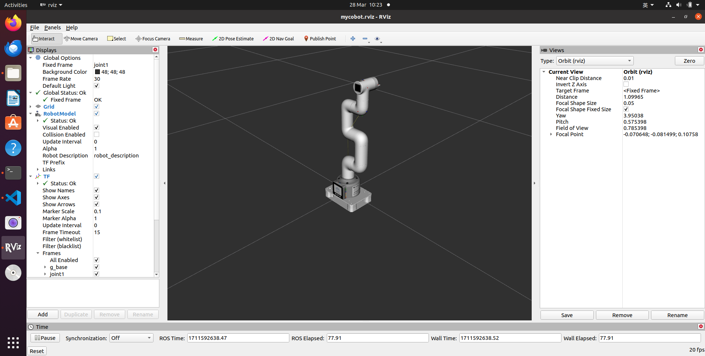

[mycobot 280 m5 pump](./mycobot_description/urdf/mycobot_280_m5/mycobot_280_m5_with_pump.urdf)

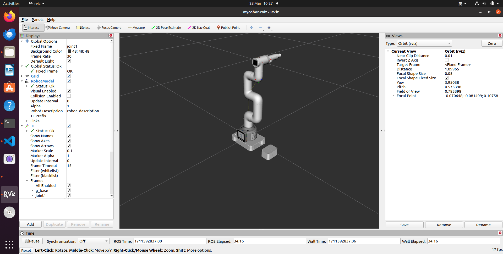

[mycobot 280 m5 camera flange](./mycobot_description/urdf/mycobot_280_m5/mycobot_280_m5_with_camera_flange.urdf)

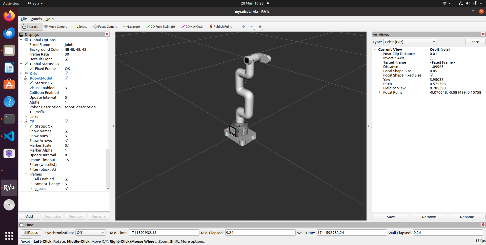

[mycobot 280 m5 camera flange & pump](./mycobot_description/urdf/mycobot_280_m5/mycobot_280_m5_with_camera_flange_pump.urdf)

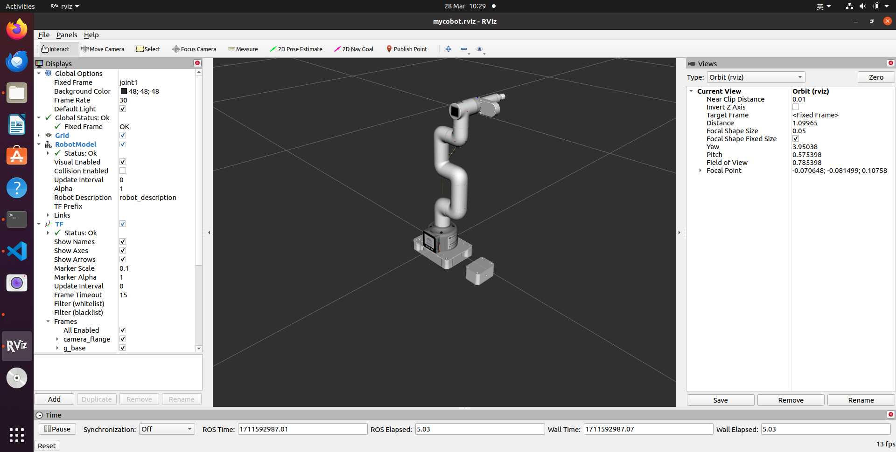

[mycobot 280 m5 adaptive gripper](./mycobot_description/urdf/mycobot_280_m5/mycobot_280_m5_adaptive_gripper.urdf)
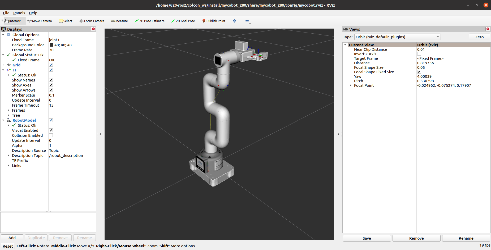

[mycobot 280 pi](./mycobot_description/urdf/mycobot_280_pi/mycobot_280_pi.urdf)

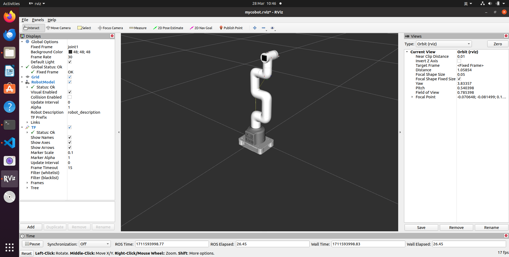

[mycobot 280 pi pump](./mycobot_description/urdf/mycobot_280_pi/mycobot_280_pi_with_pump.urdf)

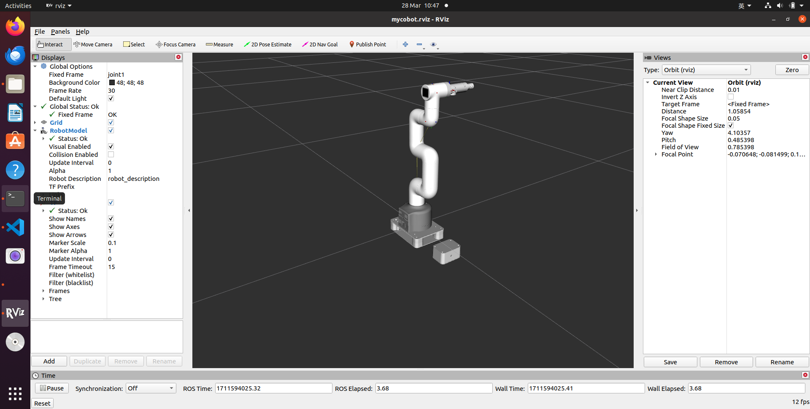

[mycobot 280 pi camera flange](./mycobot_description/urdf/mycobot_280_pi/mycobot_280_pi_with_camera_flange.urdf)

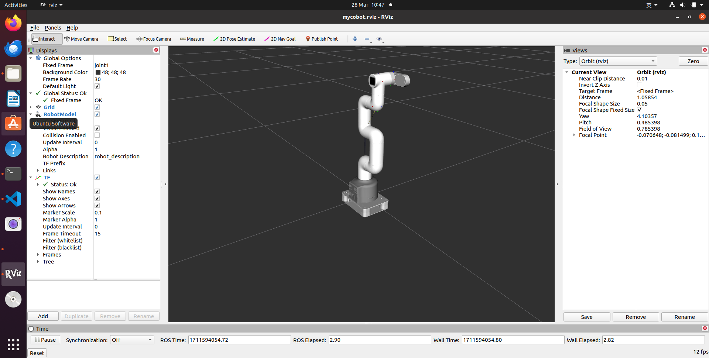

[mycobot 280 pi camera flange & pump](./mycobot_description/urdf/mycobot_280_pi/mycobot_280_pi_with_camera_flange_pump.urdf)

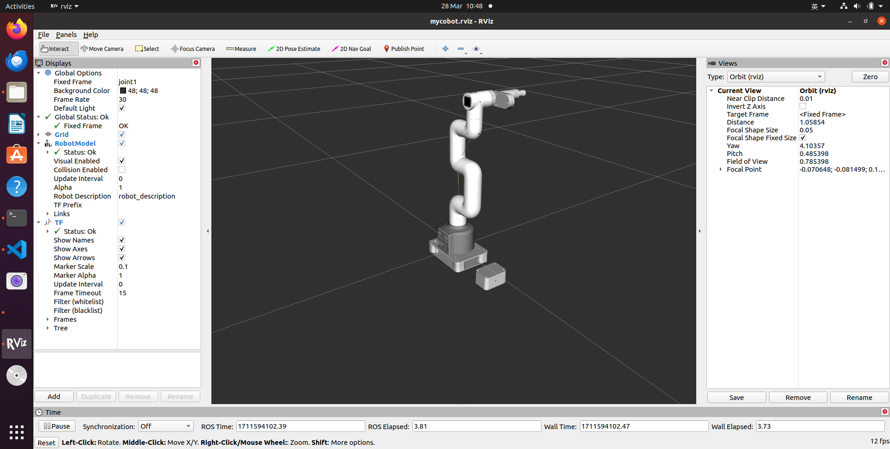

[mycobot 280 pi adaptive gripper](./mycobot_description/urdf/mycobot_280_pi/mycobot_280_pi_adaptive_gripper.urdf)
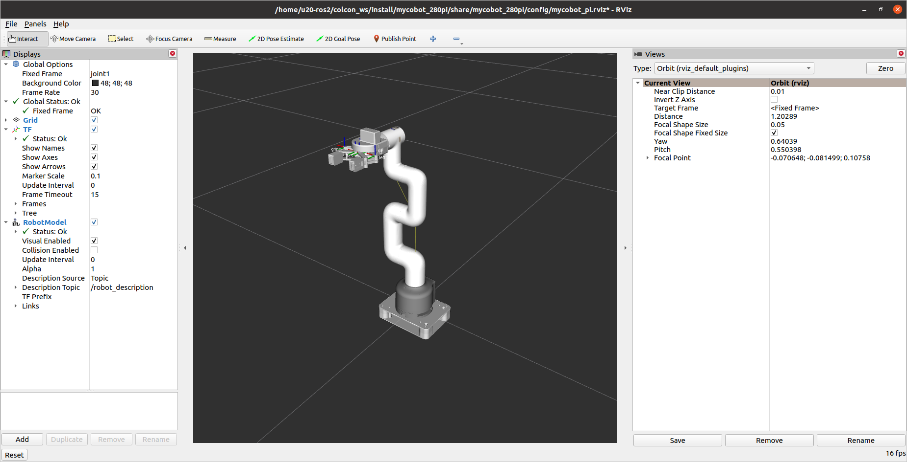


[mycobot 280 JetsonNano](./mycobot_description/urdf/mycobot_280_jn/mycobot_280_jn.urdf)

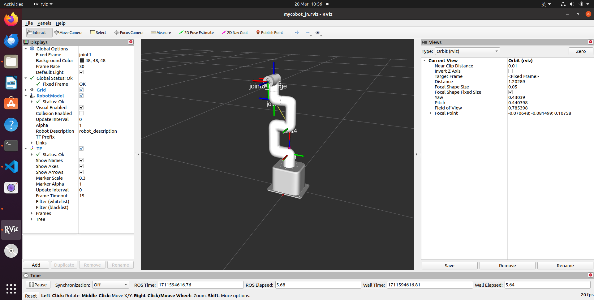

[mycobot 280 JetsonNano adaptive gripper](./mycobot_description/urdf/mycobot_280_jn/mycobot_280_jn_adaptive_gripper.urdf)
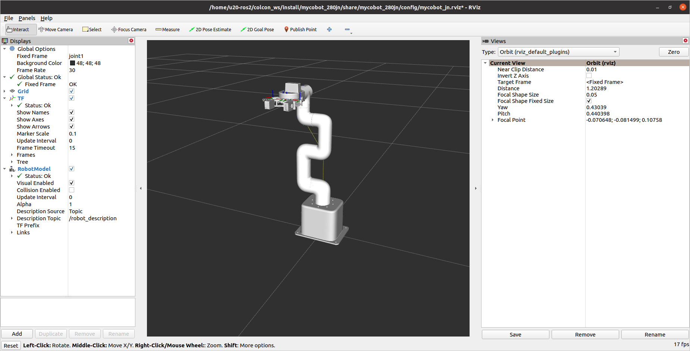


[mycobot 280 Arduino](./mycobot_description/urdf/mycobot_280_arduino/mycobot_280_arduino.urdf)

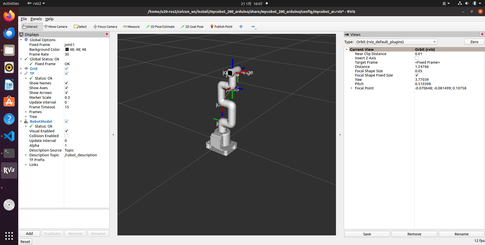

[mycobot 280 Arduino adaptive gripper](./mycobot_description/urdf/mycobot_280_arduino/mycobot_280_arduino_adaptive_gripper.urdf)
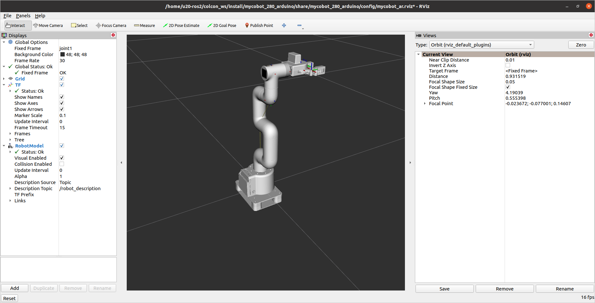


[mycobot 280 x3pi](./mycobot_description/urdf/mycobot_280_x3pi/mycobot_280_x3pi.urdf)


[mycobot 280 x5pi](./mycobot_description/urdf/mycobot_280_x5pi/mycobot_280_x5pi.urdf)


[mycobot 280 RDKX5](./mycobot_description/urdf/mycobot_280_rdkx5/mycobot_280_rdkx5.urdf)

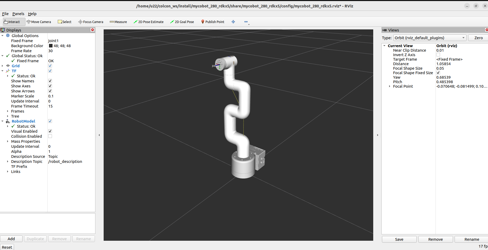

[mycobot 280 RDKX5 adaptive gripper](./mycobot_description/urdf/mycobot_280_rdkx5/mycobot_280_rdkx5_adaptive_gripper.urdf)

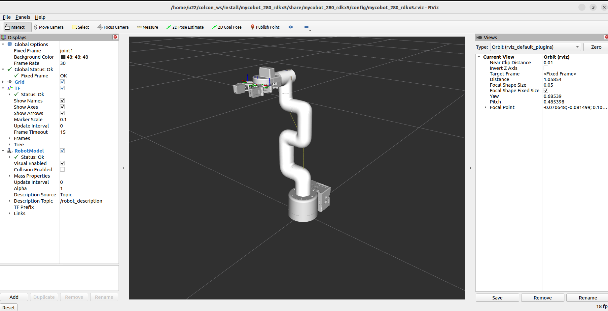
