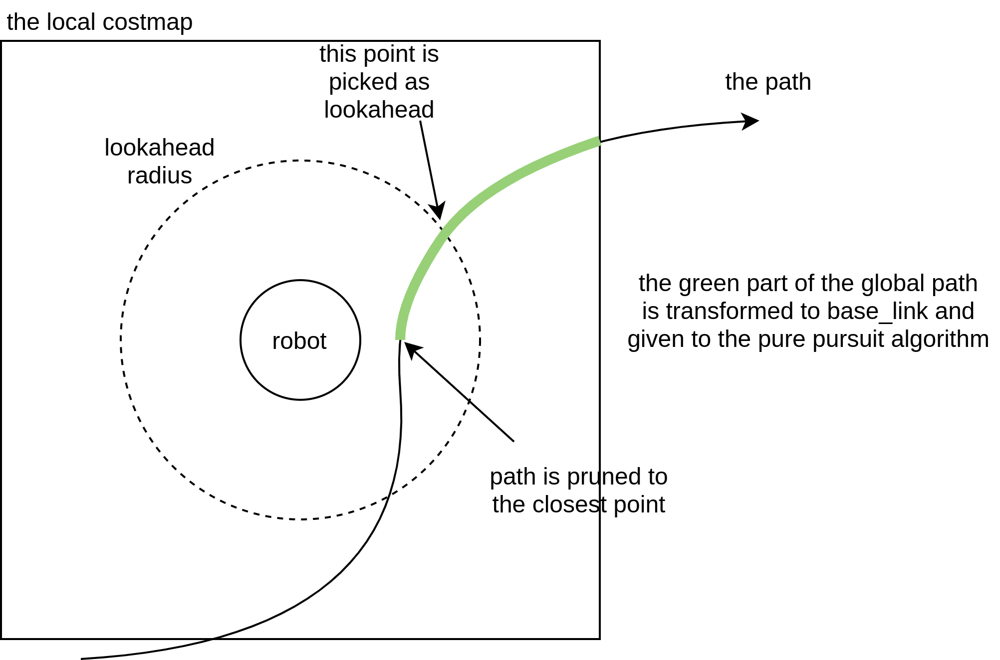

## GENERAL EXPLANATION
The distance used to find the point to drive towards is the lookahead distance.

In order to simply book-keeping, the global path is continuously pruned to the closest point to the robot (see the figure below) so that we only have to process useful path points. Then, the section of the path within the local costmap bounds is transformed to the robot frame and a lookahead point is determined using a predefined distance.

Finally, the lookahead point will be given to the pure pursuit algorithm which finds the curvature of the path required to drive the robot to the lookahead point. This curvature is then applied to the velocity commands to allow the robot to drive.




## REGULATED PP.
The Regulated Pure Pursuit controller implements active collision detection. We use a parameter to set the maximum allowable time before a potential collision on the current velocity command. Using the current linear and angular velocity, we project forward in time that duration and check for collisions. 

```
use_collision_detection: true
max_allowed_time_to_collision_up_to_carrot: 0.4
```

#### COLLISION DETECTION:
However, if you’re maneuvering in tight spaces, it makes alot of sense to only search forward a given amount of time to give the system a little leeway to get itself out. In confined spaces especially, we want to make sure that we’re collision checking a reasonable amount of space for the current action being taken (e.g. if moving at 0.1 m/s, it makes no sense to look 10 meters ahead to the carrot, or 100 seconds into the future).

If you set the maximum allowable to a large number, it will collision check all the way, but not exceeding, the lookahead point. 

We visualize the collision checking arc on the lookahead_arc topic.

Note: The maximum allowed time to collision is thresholded by the lookahead point, starting in Humble. This is such that collision checking isn’t significantly overshooting the path, which can cause issues in constrained environments. 

#### LOOKAHEAD POINT == CARROT??
We implement the adaptive pure pursuit’s main contribution of having velocity-scaled lookahead point distances.
There are parameters for setting the lookahead gain (or lookahead time) and thresholded values for minimum and maximum.

```
lookahead_dist: 0.6
```
*SOVRASCRITTO DA:*
```
use_velocity_scaled_lookahead_dist: true 
lookahead_time: 0.8 # quanto avanti è il carrot dinamico (minore = + vicino)
min_lookahead_dist: 0.2 #* se use_velocity_scaled_lookahead_dist: true
max_lookahead_dist: 0.5 #* se use_velocity_scaled_lookahead_dist: true
```

###### L'idea è questa:
c'è una curva (rallenta x settings sotto)
la path passa vicino ad un muro (rallenta x settings sotto)
rallentando il carrot si avvicina e il robot è più preciso.

#### SLOW DOWN CLOSER TO TARGET:
questione dell'errore

```
min_approach_linear_velocity: 0.05
approach_velocity_scaling_dist: 0.3
```


#### COST FUNCTIONS:
The cost functions penalize the robot’s speed based on its proximity to obstacles and the curvature of the path.

```
use_regulated_linear_velocity_scaling: true
regulated_linear_scaling_min_radius: 0.4 #*raggio sotto il quale diminuisce la velocità
regulated_linear_scaling_min_speed: 0.15
```

```
use_cost_regulated_linear_velocity_scaling: true
cost_scaling_dist: 0.3 # distanza minima dal quale l'algoritmo diminuisce velocità
cost_scaling_gain: 1.0 # quanto velocemente il robot frena quando entra nella cost_scaling_dist
inflation_cost_scaling_factor: 5.0
```